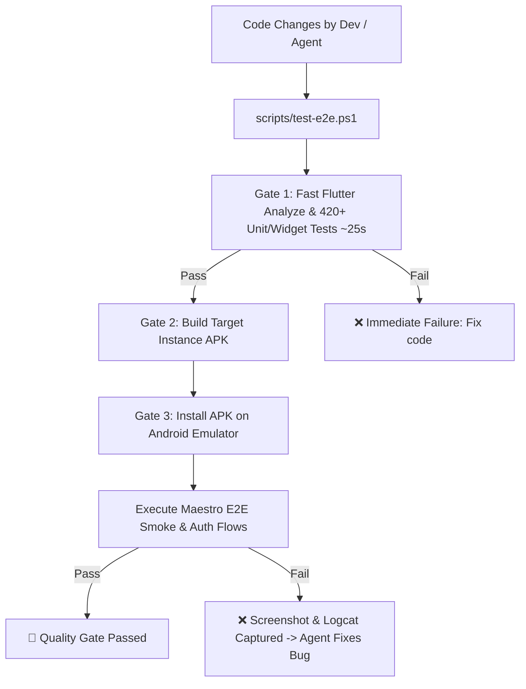

# Automated E2E Testing & Quality Gate Guide

Christian-Tube enforces a **Tiered Quality Gate** architecture to ensure that every compiled APK (`christian-app.apk`, `centum-academy.apk`) is thoroughly verified both before and after compilation.

The exact same tests and flows run **locally** (for developers and AI coding agents) and in **GitHub Actions (CI/CD)** before publishing releases.

---

## Testing Philosophy: The E2E Pyramid

To maintain a fast and stable CI pipeline, Christian-Tube strictly follows this testing distribution rule:

- **E2E Testing (Maestro)**: *Must* cover **every important user action** and critical path journey (e.g., Video Playback, Bible Reading, Offline Downloads, Search). These tests run on the compiled APK and guarantee the app works from the user's perspective.
- **Unit & Integration Testing (Flutter Test)**: *Must* cover all **minor stuff, edge cases, error handling, state management, and utility functions**. These tests execute in milliseconds and ensure individual components (e.g., date parsers, API error states, widget layout boundaries) function correctly without the overhead of booting an emulator.

---

## Architecture Overview



---

## 1. Quick Start: Running Tests Locally

### Prerequisites
1. **Android SDK & `adb`**: Installed via Android Studio or command-line tools.
2. **Target Device**: Either a running Android emulator or a physical Android phone connected via USB debugging.
3. **Maestro CLI**:
   - **Windows (PowerShell)**:
     ```powershell
     powershell -c "Invoke-WebRequest -Uri 'https://get.maestro.mobile.dev' -OutFile 'install.ps1'; .\install.ps1"
     ```
   - **macOS / Linux**:
     ```bash
     curl -FsSL "https://get.maestro.mobile.dev" | bash
     ```

---

### Running the E2E Quality Gate

#### On Windows (PowerShell):
```powershell
# Run full suite: Unit tests + Build APK + Install + Maestro smoke flow
.\scripts\test-e2e.ps1

# Test a specific instance
.\scripts\test-e2e.ps1 -Instance centum_academy

# Run only the E2E flow (skipping unit tests if already green)
.\scripts\test-e2e.ps1 -SkipUnit

# Run without re-compiling the APK (quick UI iteration)
.\scripts\test-e2e.ps1 -SkipUnit -SkipBuild

# Run the Google Sign-In authentication flow
.\scripts\test-e2e.ps1 -Flow google_auth_flow.yaml
```

#### On macOS / Linux (Bash):
```bash
./scripts/test-e2e.sh christian_tube smoke_flow.yaml
```

---

## 2. AI Coding Agent Workflow (Self-Healing Loop)

When an AI coding agent (like Antigravity) works on features or fixes bugs in the mobile codebase:

1. **Agent edits code** under `apps/mobile/lib/`.
2. **Agent runs local gate**:
   ```powershell
   .\scripts\test-e2e.ps1 -SkipBuild
   ```
3. **If any test fails**:
   - The test runner prints the exact failing assertion line.
   - For UI failures, Maestro saves a screenshot at `~/.maestro/tests/`.
   - The agent reads the error and screenshot, edits the widget/controller to fix the issue, and re-runs until all gates pass.

---

## 3. Google Sign-In E2E Testing (Pre-authenticated Snapshot)

To test Google Sign-In end-to-end without getting blocked by Google's anti-bot/2FA guards on cloud runners, we use the **Pre-authenticated Snapshot (Approach C)**:

### One-Time Local Setup for Google Auth:
1. **Create an AVD with Google APIs**:
   ```bash
   avdmanager create avd -n test_device -k "system-images;android-33;google_apis;x86_64" --device "pixel_6"
   ```
2. **Boot the emulator**:
   ```bash
   emulator -avd test_device -no-snapshot-load
   ```
3. **Log in once manually**:
   - Open Android **Settings > Passwords & Accounts > Add Account > Google**.
   - Log into your dedicated CI test account (e.g. `christiantube.ci.test@gmail.com`).
   - Launch ChristianApp, tap **Sign in with Google**, and accept the one-time OAuth consent screen.
4. **Save the snapshot**:
   ```bash
   adb emu snapshot save google_auth
   ```

Now, whenever the emulator starts with `-snapshot google_auth`, Android boots in ~3 seconds with the Google account already authenticated. Maestro's `.maestro/google_auth_flow.yaml` simply taps the account name to complete the login cleanly.

---

## 4. GitHub Actions CI Quality Gate

The release pipeline (`.github/workflows/release.yml`) executes the following automated gates on every release:

| Gate | Description | Action on Failure |
| :--- | :--- | :--- |
| **Gate 1: Code & Unit Quality Gate** | Runs `flutter analyze --no-fatal-infos` and all 420+ unit and widget tests. | Aborts run immediately before building APKs. |
| **Gate 2: Multi-Instance Compilation** | Obfuscates and compiles release APKs for `christian_tube` and `centum_academy`. | Aborts release on build errors. |
| **Gate 3: Android Emulator Smoke Test** | Boots a headless Pixel 6 emulator (`android-33`, Google APIs), installs the staged APK, and executes Maestro `.maestro/smoke_flow.yaml`. | Aborts release, captures screenshots and logs, and uploads them to GitHub Actions artifacts (`e2e-failure-*`). |
| **Gate 4: Publish Release** | Tags and publishes the release (with `--prerelease` for beta builds). | Only executes when Gates 1, 2, and 3 are 100% green. |

---

## 5. Adding New E2E Flows

All E2E flows are written in declarative YAML under `.maestro/`:
- **`smoke_flow.yaml`**: Cold start, bottom navigation bar, all major tabs (Words, Audio, Bible, Profile), update checking.
- **`google_auth_flow.yaml`**: Google Sign-In button click, native account chooser, profile signed-in state.

To test a new user journey (e.g. playing a sermon audio track or creating a video clip), add a new `.yaml` file to `.maestro/` and run:
```powershell
.\scripts\test-e2e.ps1 -Flow your_new_flow.yaml
```
